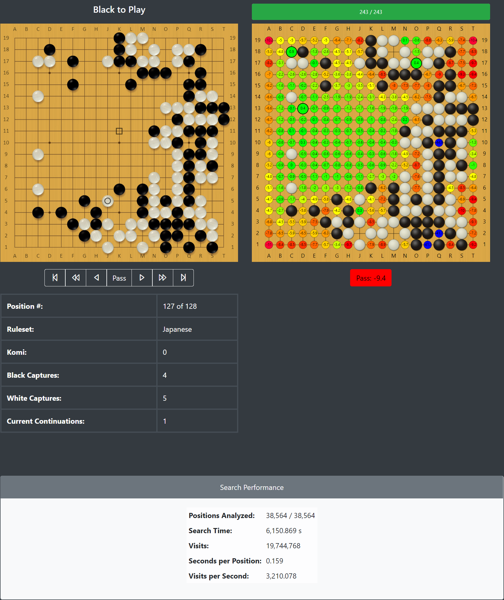

# BroadGo

BroadGo is a a [KataGo](https://github.com/lightvector/KataGo) wrapper that aims to give users a broader understanding
of the reviewed positions.  UCTS driven by good training is powerful precisely because it is able to prune
[Go's](https://en.wikipedia.org/wiki/Go_(game)) preposterously broad search tree effectively.  Unfortunately, this has a
direct impact on how useful UCTS-based AIs are for helping human players understand why certain moves receive emphasis
as opposed to others.  This is especially true for weaker players.  To an extent, the result is that human players mimic
AI moves and sequences without understanding them.  Some players seem to assume that the new sequences have made old
choices inferior.  They do not understand that the values the UCTS-oriented networks have learned for moves are best
interpreted in most situations as the network's preference or even its comfort zone.  There are frequently moves that
lead to similar final game results that do not get much search time; humans often conclude that these moves are "bad"
as a result.  Thus, BroadGo combine's KataGo's strong UCTS search and positional value estimation with a forced broad
search.  Every possible move in a position gets searched to enough of a depth to enable users to get a feel for which
moves could be viable even though KataGo is disinclined to search it.  In a different but related vein, it can make
starkly clear which moves are not considered because they are in fact bad.



## How to Run
BroadGo currently has two separate applications: a backend server that collaborates with KataGo, and a UI that runs in
the browser.

### KataGo
You can skip most of these steps if you already have KataGo installed.

1. Navigate to [the KataGo releases page](https://github.com/lightvector/KataGo/releases) to download the version of
   KataGo that best matches your hardware.
   
2. Download a KataGo model.  You can find the list of models that predate the KataGo Training project [here](
     https://d3dndmfyhecmj0.cloudfront.net/g170/neuralnets/index.html
   ).  I recommend the [ten-block network](
     https://d3dndmfyhecmj0.cloudfront.net/g170/neuralnets/g170e-b10c128-s1141046784-d204142634.bin.gz
   ) as it will run much faster than the deeper networks.  Note that you are likely to see marked trade-offs between
   speed and accuracy by choosing deeper networks.

3. If you downloaded an OpenCL KataGo version, I _strongly_ recommend running a full tune.  It can take many hours, but
   getting reasonable results from BroadGo requires shaving milliseconds off how long each position takes to analyze.
   You can do this by running the following command inside your KataGo directory:
   `katago tuner -model {MODEL YOU DOWNLOADED} -xsize 19 -ysize 19 -full -batchsize 256` .  If you have multiple GPUs
   and plan to use only a subset, you may also need to add `-gpus {COMMA-SEPARATED LIST OF GPU IDENTIFIERS}`.

4. Generate a new configuration geared toward shallow searches.  This will provide a strong hint as to what thread
   configurations will work best with your system.  It will also help you determine whether you need to go more shallow
   for faster responses or can afford to go deeper for potentially better results.  The command to use here is
   `katago genconfig -model {MODEL YOU DOWNLOADED} -output broadgo.cfg`.  This starts a wizard.  I recommend using
   options similar to those used in [my own run](exampleGenconfig.txt) , though you will need to tailor some of these
   results based upon your machine.  I recommend looking for a depth that lets you search the 10 positions in 0.3
   seconds or less.  On my system, that was between 64 and 128 visits.

5. There are a handful of fields you should add or change to get the most out of this configuration:

```
logFile = gtp.log  # use this instead of logDir unless you want many files generated over time
logAllGTPCommunication = false
maxVisits = 64  # or whatever value got you the best balance between speed and depth
maxPlayouts = 1048576
maxTime = 3600
searchFactorAfterOnePass = 1
searchFactorAfterTwoPass = 1
nnMaxBatchSize = 256  # This MUST be specified for analysis mode.  You might need to raise or lower this value for your machine.
reportAnalysisWinratesAs = SIDETOMOVE
numAnalysisThreads = 1
```

6. Test that you have configured everything correctly with the following command: `katago analysis -config {YOUR
   GENERATED CONFIGURATION FILE} -model {MODEL YOU DOWNLOADED}` .  If you see output like the following, your KataGo
   configuration is ready to go!  Kill the running KataGo instance so the Flask application can start its own.

```
E:\KataGo-1.8.0>katago analysis -config broadgo.cfg -model g170e-b10c128-s1141046784-d204142634.bin.gz
KataGo v1.8.0
Creating context for OpenCL Platform: NVIDIA CUDA (NVIDIA Corporation) (OpenCL 1.2 CUDA 11.2.135)
Using OpenCL Device 0: GeForce GTX 1080 Ti (NVIDIA Corporation) OpenCL 1.2 CUDA (Extensions: cl_khr_global_int32_base_atomics cl_khr_global_int32_extended_atomics cl_khr_local_int32_base_atomics cl_khr_local_int32_extended_atomics cl_khr_fp64 cl_khr_byte_addressable_store cl_khr_icd cl_khr_gl_sharing cl_nv_compiler_options cl_nv_device_attribute_query cl_nv_pragma_unroll cl_nv_d3d10_sharing cl_khr_d3d10_sharing cl_nv_d3d11_sharing cl_nv_copy_opts cl_nv_create_buffer cl_khr_int64_base_atomics cl_khr_int64_extended_atomics cl_khr_device_uuid)
Loaded tuning parameters from: E:\KataGo-1.8.0/KataGoData/opencltuning/tune8_gpuGeForceGTX1080Ti_x19_y19_c128_mv8.txt
--------------
WARNING: Config had unused keys! You may have a typo, an option you specified is being unused from broadgo.cfg
WARNING: Unused key 'allowResignation' in broadgo.cfg
WARNING: Unused key 'hasButton' in broadgo.cfg
WARNING: Unused key 'koRule' in broadgo.cfg
WARNING: Unused key 'logAllGTPCommunication' in broadgo.cfg
WARNING: Unused key 'multiStoneSuicideLegal' in broadgo.cfg
WARNING: Unused key 'ponderingEnabled' in broadgo.cfg
WARNING: Unused key 'resignConsecTurns' in broadgo.cfg
WARNING: Unused key 'resignThreshold' in broadgo.cfg
WARNING: Unused key 'scoringRule' in broadgo.cfg
WARNING: Unused key 'searchFactorWhenWinning' in broadgo.cfg
WARNING: Unused key 'searchFactorWhenWinningThreshold' in broadgo.cfg
WARNING: Unused key 'taxRule' in broadgo.cfg
WARNING: Unused key 'whiteHandicapBonus' in broadgo.cfg
--------------
Started, ready to begin handling requests
```

### Backend Server
You will need a Python 3.8+ environment of some kind.  I use
[miniconda](https://docs.conda.io/en/latest/miniconda.html), so the instructions will aim at that.

0. Clone this repository.
1. _OPTIONAL_: Create an environment for BroadGo: `conda create --name broadgo`
2. Activate your environment: `conda activate broadgo`
3. Install Flask: `conda install flask -c conda-forge`
4. Install Flask CORS: `conda install flask-cors -c conda-forge`
5. Install Flask RESTful: `conda install flask-restful -c conda-forge`

TODO: I need to write more here.

### UI

TODO: I need to write this at all.